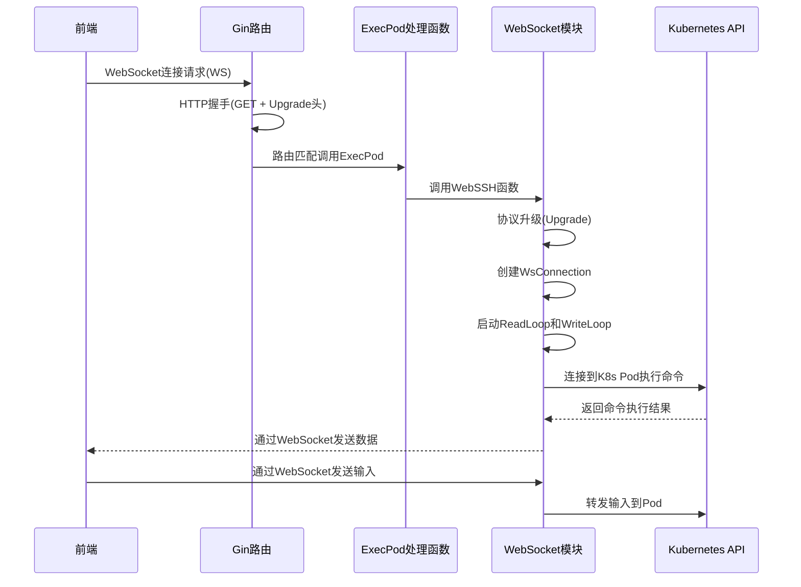

# WebSocket 连接建立与 WebSSH 实现流程

## 整体流程概述
1. WebSocket 连接的建立需要经过 HTTP 升级握手过程
2. 然后通过 Gin 路由匹配到对应的处理函数
3. 最终升级为 WebSocket 连接并实现 WebSSH 功能

###  前端发起 WebSocket 请求
```javascript
// 前端代码示例
const ws = new WebSocket('ws://127.0.0.1:9090/api/kubernetes/exec/namespace/kube-system/podName/kube-proxy-qvrbl/containerName/kube-proxy');
```
### HTTP 握手阶段
```markdown
GET /api/kubernetes/exec/namespace/default/podName/nginx/containerName/nginx HTTP/1.1
Host: localhost:8080
Upgrade: websocket
Connection: Upgrade
Sec-WebSocket-Key: xxx
Sec-WebSocket-Version: 13
```
### 路由匹配与处理
```go
// Gin 路由匹配到对应的 GET 路由
// internal/router/router.go
k8sGroup.GET("/exec/namespace/:namespace/podName/:podName/containerName/:containerName", api2.ExecPod)
```
```go
//调用 ExecPod 处理函数
// internal/api/pod.go
func ExecPod(c *gin.Context) {
    namespace := c.Param("namespace")
    podName := c.Param("podName")
    containerName := c.Param("containerName")
    method := c.DefaultQuery("action", "sh")
    if err := websocket.WebSSH(namespace, podName, containerName, method, c.Writer, c.Request); err != nil {
        // 错误处理
    }
}
```
### WebSocket 协议升级
```go
// 在 websocket.WebSSH 函数中完成协议升级
// internal/websocket/websocket.go
func NewWsConnection(resp http.ResponseWriter, req *http.Request) (*WsConnection, error) {
    // 使用 gorilla/websocket 的 Upgrader 将 HTTP 连接升级为 WebSocket 连接
    if upgrade, err = wsUpgrader.Upgrade(resp, req, nil); err != nil {
        return nil, errors.New("websocket 协议升级失败")
    }
    // ...
}
```
### 建立 WebSocket 连接并实现 WebSSH
```go
// 建立连接后，启动读写循环处理数据
// internal/websocket/websocket.go
func NewWsConnection(resp http.ResponseWriter, req *http.Request) (*WsConnection, error) {
    // ...
    // 启动读循环、写循环
    go ws.ReadLoop()
    go ws.WriteLoop()
    return ws, nil
}

```
# 流程图
