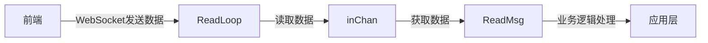
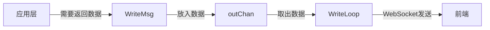
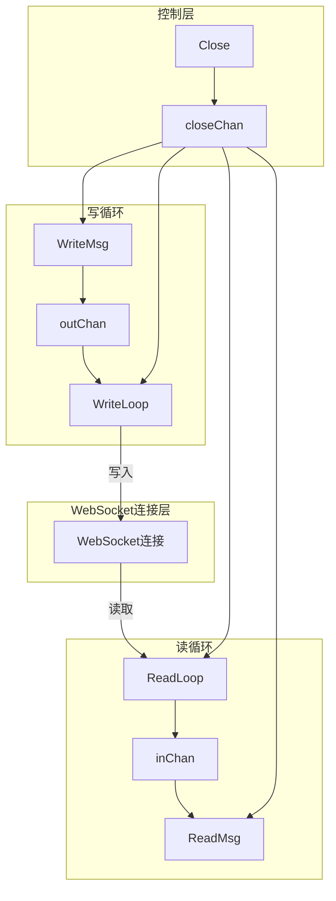

# WebSocket 模块设计说明：
## 🔄 整体流程 前端输入 → 后端处理

1. 前端通过 WebSocket 发送数据
2. ReadLoop 读取数据 → 放入 inChan
3. ReadMsg() 获取数据供业务逻辑处理
## 🔄 整体流程 后端响应 → 前端展示

1. 后端业务逻辑需要返回数据
2. WriteMsg() 将数据放入 outChan
3. WriteLoop 取出数据 → 通过 WebSocket 发送给前端

## 🏗️ 架构设计
